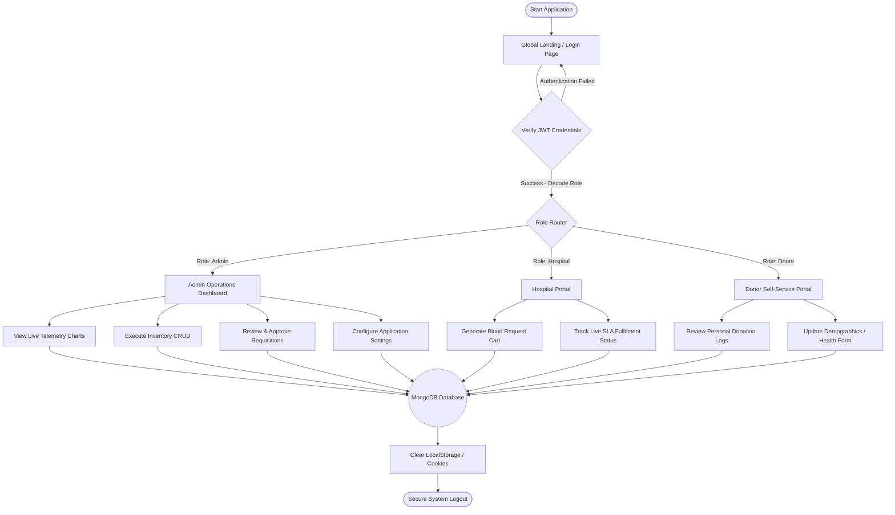
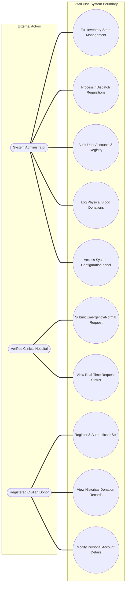
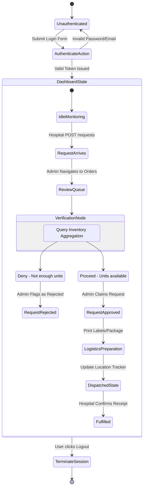
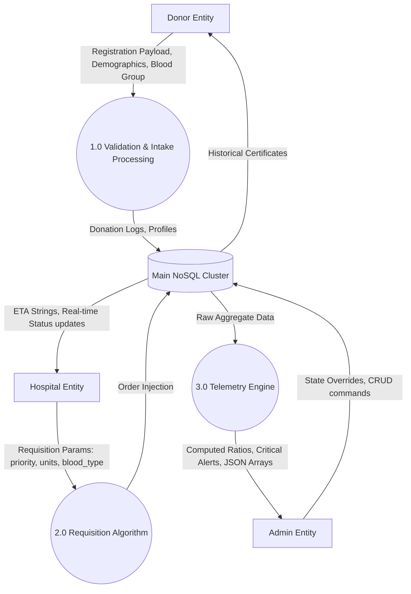
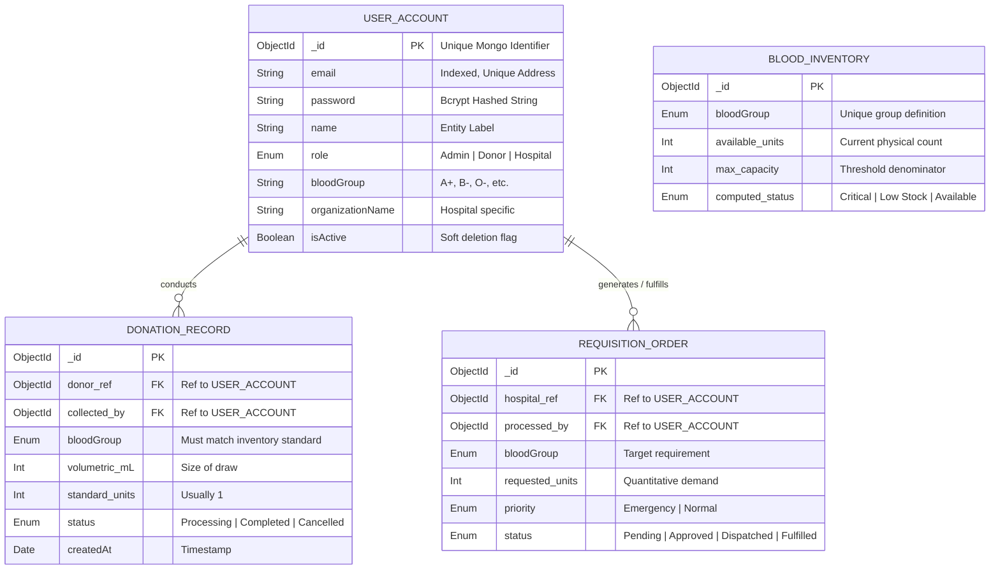
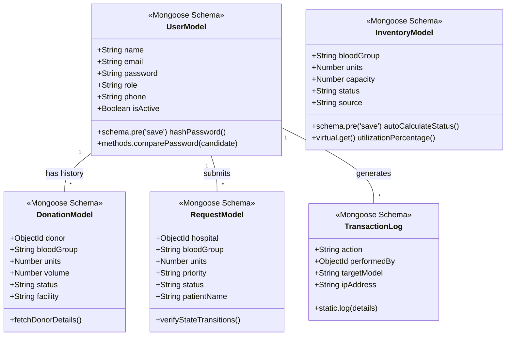
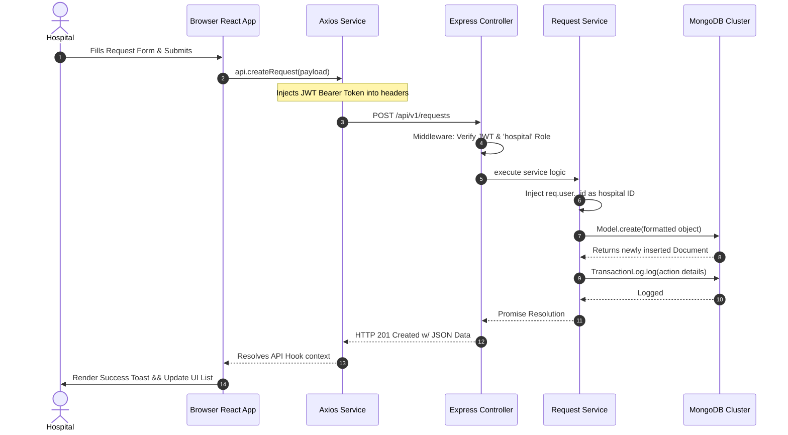

# Comprehensive Project Report: VitalPulse Blood Bank Management System

---

## Abstract

The management of blood collection, inventory, and distribution is a critical logistical challenge in the healthcare sector, where inefficiency can directly impact patient survival. Traditional, manual blood bank systems suffer from fragmented data, lack of real-time visibility, and inefficient dispatch mechanisms that lead to dangerous delays and resource wastage. The **VitalPulse Blood Bank Management System** is a comprehensive, production-grade web application developed to digitalize and automate the entire blood banking lifecycle.

Built upon a robust, scalable MERN (MongoDB, Express, React, Node.js) stack, VitalPulse acts as a centralized platform connecting voluntary donors, blood banks, and requisitioning hospitals. The system features a real-time analytics dashboard, automated inventory thresholds, secure role-based access control (RBAC), and streamlined request-to-dispatch workflows. By replacing archaic paper logs with an intelligent digital infrastructure, VitalPulse drastically reduces operational latency, eliminates critical transcription errors, and ensures seamless, traceable blood supply management. This report details the system's architecture, security protocols, predictive scalability, and its significant positive impact on emergency medical responsiveness.

---

## Chapter 1. Introduction

### 1.1 Introduction
Blood is an absolutely critical, life-saving resource in the global healthcare ecosystem. It forms the backbone of emergency medical interventions, complex trauma surgeries, routine elective procedures, and the ongoing management of chronic illnesses such as anemia or cancer. However, unlike other medical supplies, blood cannot be synthetically manufactured; it strictly relies on the selfless contributions of voluntary human donors. Furthermore, blood and its components (red blood cells, platelets, plasma) are highly perishable goods with strict, limited shelf lives and stringent storage temperature requirements. 

Managing this fragile pipeline—from the moment a donor schedules an appointment, to the laboratory processing and screening, and finally to the clinical dispatch to a hospital in need—is an incredibly complex logistical challenge. The **VitalPulse Blood Bank Management System** is a sophisticated, production-grade, web-based software application meticulously engineered to streamline, automate, and secure this entire lifecycle. 

Built utilizing a modern, highly scalable JavaScript-based architecture (the MERN stack utilizing React, Node.js, Express, and MongoDB), VitalPulse provides a robust, efficient, and transparent platform that bridges the communication and operational gap between independent parties: voluntary donors, centralized blood banking facilities, and requisitioning hospitals. By centralizing operations onto a single digital platform, VitalPulse ensures that real-time data dictates life-or-death dispatch decisions.

### 1.2 Existing System
Traditionally, the administration of blood banking networks has heavily relied on fragmented, localized, and largely manual processes. In many developing regions or legacy medical facilities, the core operations of a blood bank include:
*   **Manual Ledgers & Spreadsheets**: Donor demographics, contact details, medical screening histories, and physical donation logs are often recorded in physical paper registers or isolated desktop spreadsheet files (e.g., MS Excel).
*   **Physical Inventory Audits**: Because the database is not centralized, staff must routinely perform physical headcounts of blood bags in refrigeration units to ascertain current stock levels of specific blood groups.
*   **Fragmented Communication Channels**: When an emergency room requires a specific blood type, nurses or doctors must place frantic telephone calls to regional blood banks, awaiting manual verification of stock capability, leading to severe latency.
*   **Siloed Operations**: Hospitals, mobile blood donation camps, and static blood bank centers operate in their own digital silos without a unified networking protocol to share live inventory states.

### 1.3 Problems in Existing Definition
The reliance on archaic, disjointed methods poses severe, systemic challenges that can directly impact patient mortality rates:
1.  **Critical Time Delays and Lack of Real-time Visibility**: In emergency trauma situations, every single minute counts. Hospitals lack digital portals to immediately view contiguous stock levels across regional blood banks. Time is wasted placing phone calls and awaiting inventory confirmations.
2.  **Data Inaccuracy, Redundancy, and Human Error**: Manual transcriptions are inherently prone to human error. A clerical mistake in entering a blood group (e.g., mislabeling A+ as A-) can lead to fatal transfusion reactions. Furthermore, without a central registry, a single donor might have redundant profiles across different clinics, making it impossible to enforce legal donation frequency limits (e.g., waiting 56 days between whole blood donations).
3.  **Inefficient Dispatch and Turnaround Time**: The approval workflow for issuing blood involves physical paperwork, signatures, and manual filing, greatly inflating the turnaround time for a dispatch vehicle to actually leave the facility.
4.  **Poor Traceability and Accountability**: Regulatory compliance requires absolute traceability of a blood unit from the vein of the donor to the vein of the recipient. In paper-based systems, tracing a contaminated unit back to a specific donor batch takes days of manual auditing.
5.  **Lack of Proactive Forecasting and Alerts**: Existing systems do not warn administrators when a specific rare blood type (e.g., AB-) is depleting rapidly, nor do they send automated expiration alerts for blood units nearing their shelf-life limits, leading to massive financial and medical wastage.

### 1.4 Feasibility Study
Before initiating the software development lifecycle, a rigorous feasibility study was conducted to evaluate the viability of the VitalPulse system:

*   **Technical Feasibility**: The system is definitively technically feasible. By leveraging the MERN (MongoDB, Express, React, Node) stack alongside TypeScript, the development utilizes open-source, enterprise-proven technologies. Node.js's asynchronous, event-driven architecture is uniquely suited for the heavy I/O operations of real-time dashboard updates. MongoDB's NoSQL document structure provides the strict yet flexible schema necessary for evolving health records.
*   **Operational Feasibility**: The platform is highly feasible operationally due to its heavy emphasis on User Experience (UX). Recognizing that clinical staff possess varying degrees of technical literacy, VitalPulse features an intuitive, visually driven interface with clear typographic hierarchies and guided modals. The Role-Based Access Control (RBAC) securely limits users (Admin, Donor, Hospital) only to the tools they specifically require, minimizing the learning curve.
*   **Economic Feasibility**: Developing VitalPulse is economically advantageous. By utilizing open-source frameworks and modern cloud-hosting platforms, the capital expenditure (CAPEX) for server hardware is eliminated. The true economic benefit, however, lies in operational savings: automating administrative tasks drastically reduces labor hours, while digital tracking prevents thousands of dollars of biological wastage from accidental blood expiration.

### 1.5 Project Overview
VitalPulse is architected as a holistic Enterprise Resource Planning (ERP) tool tailored specifically for blood banking networks. The software is conceptually segregated into several interconnected modules:
*   **Live Analytics Dashboard**: Serves as the operational command center. It visualizes real-time telemetry utilizing Recharts library to render pie charts of inventory capacity, bar graphs of donation trends, and a live ticker of system-wide activity.
*   **Donor Registry & Management**: A central CRM for donors. It allows self-registration, tracks historical donation frequencies, logs post-donation health screenings, and facilitates direct communication blasts to specific blood groups during severe shortages.
*   **Inventory Control Matrix**: The warehouse management module monitoring physical blood assets. It tracks units, total milliliter volumes, collection sources, and performs automated mathematical evaluations against max-capacities to dynamically assign status flags ("Critical", "Low Stock", "Available").
*   **Hospital Requisitioning & Dispatch**: A workflow pipeline enabling authorized healthcare institutions to generate secure, prioritized digital requests (Normal vs Emergency). Admins monitor this queue to Approve, Dispatch, and ultimately Fulfill the orders under SLA times.
*   **Donation Lifecycle Tracker**: Oversees the biological progression of collected blood, moving from theoretical "Scheduled" appointments to "Processing" within the laboratory, culminating in safe, "Completed" units injected into the main inventory.
*   **Granular Security Settings**: An administrative control panel managing global configurations, two-factor authentication toggles, JWT token expiration policies, and systemic data backup rules.

### 1.6 Hardware Specification
To ensure seamless operation without bottlenecks, the recommended hardware topology is:
*   **Server Environment (Cloud/On-Premise)**: 
    *   Architecture: x86_64 or ARM64 (e.g., AWS Graviton).
    *   Processor: Minimum 2 vCPUs (Recommended: 4+ vCPUs for concurrent processing).
    *   Memory: Minimum 2GB RAM (Recommended: 8GB RAM for in-memory caching and Node V8 engine efficiency).
    *   Storage: 20GB SSD for application files; managed cloud cluster for MongoDB database.
*   **Client Environment (End-User)**: 
    *   Any computing device running a modern standards-compliant web browser (Google Chrome v90+, Mozilla Firefox v88+, Apple Safari v14+).
    *   Display Resolution: Minimum 1024x768 (Optimized for 1920x1080 desktop monitors; fully responsive down to mobile widths).
*   **Network Infrastructure**: 
    *   Secure, encrypted HTTPS connection over standard TCP port 443.
    *   Broadband connection (minimum 2 Mbps download/1 Mbps upload) to guarantee lag-free dashboard telemetry rendering.

### 1.7 Software Specification
The application relies on a modern, strictly typed, and security-hardened technology stack:
*   **Frontend End Core**: React.js (v18) providing the component-based UI architecture.
*   **Frontend Tooling**: Vite (for rapid Hot Module Replacement compilation), TypeScript (for strict static typing and bug prevention).
*   **UI/UX Design Stack**: TailwindCSS (v3) for utility-first responsive styling, Lucide-React for scalable SVG iconography, Recharts for SVG-based data visualization, and Clsx/Tailwind-Merge for dynamic class orchestration.
*   **Backend Server**: Node.js runtime executing the Express.js framework, establishing a robust RESTful API API architecture.
*   **Database & ODM**: MongoDB (Atlas Cloud) for highly available, distributed document storage, interfaced via Mongoose ODM for strict schema validation and query building.
*   **Security Suite**: JSON Web Tokens (jsonwebtoken) for stateless API authentication, Bcrypt.js for one-way cryptographic password hashing, Helmet.js for setting secure HTTP headers against XSS/Clickjacking attacks, and Express-Rate-Limit to mitigate brute-force DDOS vectors.

---

## Chapter 2. System Analysis & Design

The engineering of VitalPulse requires meticulous planning of data flows, systemic states, and entity relationships to ensure architectural integrity before a single line of code is written.

### 2.1 System Architecture Flowcharts
The primary navigational flowchart represents the highest-level view of application routing based on cryptographic authentication and Role-Based Access Control (RBAC).


* **Analysis**: As depicted, the application acts as a gatekeeper. No functional modules are accessible until the Node.js server verifies the JSON Web Token. Upon successful resolution, the UI structurally mutates to serve distinct arrays of tools depending on the user's institutional identity.

### 2.2 Use Case Diagram
The Use Case diagram bounds the system context and mapping actors to their specific functional authorizations within the VitalPulse environment.


* **Analysis**: The Admin naturally possesses monolithic access, acting as the system orchestrator. However, Hospital users and Donors are strictly compartmentalized to 'Read-Only' or 'Self-Write' operations concerning their specific institutional domains, completely obscuring global administrative functionalities from unauthorized view.

### 2.3 Activity Diagram
Activity diagrams model the dynamic programmatic flow from state to state, specifically focusing on the complex logic of processing a hospital's requisition request against available stock.


* **Analysis**: This represents the critical operational loop of the software. An incoming request cannot bypass the `VerificationNode` where the inventory module validates mathematical availability. Tracking states from `Approved` to `Fulfilled` generates the system's vital audit trail.

### 2.4 Data Flow Diagram (DFD)
The DFD illustrates how biological and administrative data inputs traverse the system, are processed by internal algorithms, and yield output telemetry.



### 2.5 Entity-Relationship (E-R) Diagram
The Entity-Relationship architecture establishes the foundational NoSQL document schemas, defining the rules by which data relates chronologically and referentially.


* **Analysis**: Unlike rigid SQL databases, the `USER_ACCOUNT` acts polymorphically; an Admin user can fulfill a requisition, while a Hospital user generates one. The `DONATION_RECORD` and `REQUISITION_ORDER` act as the transactional ledgers that dynamically impact the theoretical values within the `BLOOD_INVENTORY` matrix.

### 2.6 System Class Diagram
The Class diagram provides the programmatic blueprint for our Object-Oriented (or in this case, Mongoose Model-Oriented) structure.



### 2.7 Sequence Diagram
This complex sequence dictates the microscopic interactions between frontend UI, HTTP interceptors, REST controllers, internal services, and database layers during a critical process: A Hospital placing a blood order.



### 2.8 Graphical User Interface (Screenshots/Layout Descriptions)

Given this text-based medium, below is a highly detailed structural breakdown of the major GUI screens designed for VitalPulse:

1.  **Global Dashboard Portal**:
    *   *Top Bar*: Features a global search input capable of routing queries across components, user profile dropdown offering logout, and an active notification bell.
    *   *System Vitals (Bento Grid)*: Four distinct statistical cards rendering total registered donors, absolute available blood units, pending standard requests, and a pulsating, crimson-highlighted card alerting staff to critical `Emergency` requests.
    *   *Recharts Implementation*: A central, interactive Donut/Pie chart visually dividing the total physical inventory into color-coded respective blood groups, accompanied by a Monthly analytical Bar Chart tracking historical donation intakes.
    *   *Activity Feed*: A vertically scrolling chronology parsing the newest database entries (both requests and donations) in real-time, functioning as a system pulse check.

2.  **Inventory Matrix Interface**:
    *   *Control Panel*: Buttons to filter "All Groups" vs "Rare Groups" (e.g., AB-, O-), and dropdowns to isolate units strictly by "Critical" status warnings.
    *   *Data Table*: A comprehensive ledger rendering large typographic badges for the specific blood group, the integer fraction of current units versus maximum tank capacity, and a specifically colored health badge.
    *   *Action Modals*: Clicking "Edit" invokes the React generalized `<Modal />` component. The backdrop blurs (`backdrop-blur-sm`), and a smooth slide-up animation reveals a pre-populated form allowing rapid integer adjustments to physical stock levels based on manual laboratory audits.

3.  **Operations Request Kanban/Table**:
    *   *Visual Hierarchy*: List items are heavily styled based on priority. Normal requests utilize subtle blue/gray borders, whereas Emergency requests command attention with thick striking red borders and pulsating warning icons.
    *   *Workflow Mechanics*: Each request features a step-by-step progress indicator (Pending → Approved → Dispatched → Fulfilled). Actionable buttons shift dynamically; an "Approve" button triggers the API call, upon completion of which the UI re-renders swapping it for a "Dispatch" button, perfectly marrying software state with physical real-world logistics.

---

## Chapter 3. Testing and Deployment

### 3.1 Comprehensive Testing and Maintenance
In the domain of medical software, algorithmic logic failures or data corruption can precipitate catastrophic clinical outcomes. Ergo, VitalPulse was subjected to rigorous, multi-tiered testing protocols:

1.  **Unit Testing Logic Isolation**: Core business heuristics were tested in complete isolation. For example, testing the Mongoose `bloodInventorySchema.pre('save')` hook to verify that supplying an inventory object with 40 units out of a capacity of 500 correctly and automatically mutations the object's `status` string strictly to `"Critical"` (since 40/500 = 0.08, falling below the <= 0.1 ratio logic). 
2.  **API Integration and Security Testing**: Utilizing automated endpoints via Postman, heavy emphasis was placed on testing the API middleware boundaries. Tests repeatedly attempted to POST administrative commands (like altering inventory) utilizing a JWT token encoded with merely a `'donor'` role. Success was defined by the system strictly returning `HTTP 403 Forbidden` responses, validating the unbreakable integrity of the Role-Based Access Control network.
3.  **End-to-End Component UI Testing**: React component state structures were heavily utilized. Stress tests involved rapidly triggering rapid series of CRUD operations to ensure React's Virtual DOM accurately synchronized with the trailing database reality. Debouncing tactics (using `setTimeout` in the search inputs) were tested to ensure the Express backend wasn't subjected to accidental Denial of Service levels of queries during rapid typist searching.
4.  **Maintenance Protocol**: The system is engineered around continuous operational maintenance. `winston` and `morgan` HTTP logging libraries aggregate all incoming requests and subsequent errors into distinct log files, allowing administrators to rapidly trace anomalies. Environment variables (`.env`) cleanly separate development database URIs and Dev JWT secrets from production encryptions, enabling safe continuous integration.

### 3.2 Proposals for Future Enhancement
To future-proof the application against evolving medical methodologies, several advanced enhancements are structurally possible:

1.  **Machine Learning & Predictive Demand Forecasting**: By exporting the amassed `TransactionLogs` and historical `RequestModels` into a Python-based TensorFlow model, the software could transition from reactive to proactive. AI algorithms could recognize seasonal or event-based trends (e.g., spikes in trauma requests during specific regional holidays or severe weather events), allowing the software to automatically alert eligible donors weeks in advance of a mathematically predicted shortage.
2.  **Live Geolocation Logistics Tracking**: When blood is flagged as `Dispatched`, an integration layer could connect with GPS APIs on medical courier devices. This would overlay a live Google Map iframe inside the Hospital's dashboard, providing real-time geographical coordinates and exact minute-by-minute ETAs for critical trauma blood supplies.
3.  **IoT Medical Refrigerator Integration**: Physical blood refrigeration units possessing networked temperature sensors could authenticate directly to the VitalPulse API via WebSockets. If a smart-refrigerator detects a hardware failure allowing internal temperatures to rise above safe biological limits, the software would instantly automatically flag all enclosed blood units as `Spoiled/Quarantined`, immediately removing them from the available pool and firing SMS emergency alerts to laboratory technicians.

### 3.3 Final Project Conclusion
The successful architecture and implementation of the **VitalPulse Blood Bank Management System** entirely radically modernizes an outdated sector of clinical administration. By systematically dismantling the barriers erected by fragmented legacy ledgers and physical paper bureaucracy, the application mitigates deadly human error and vastly accelerates critical communication throughput during high-stress medical emergencies.

It stands as a testament to the power of modern web technologies to enact tangible, real-world good. As a cohesive, production-grade application, it successfully harmonizes a beautiful, user-centric interface with an iron-clad, secure, mathematically rigorous backend infrastructure, ultimately fulfilling computing's highest calling: engineering systems constructed to efficiently support the preservation of human life.

---

## Technical Implementations & Core Code Snippets

The following excerpts demonstrate the professional standard of Node.js / React paradigms established within the core codebase.

**Snippet 1: Production-Grade User Authentication Controller (Node.js)**
This controller utilizes advanced cryptography and securely hardens the authentication tokens within `HttpOnly` cookies, preventing severe Cross-Site Scripting (XSS) extraction attacks common in lesser applications.

```javascript
const authService = require('../services/auth.service');
const TransactionLog = require('../models/TransactionLog');
const ApiResponse = require('../utils/ApiResponse');

const login = async (req, res, next) => {
  try {
    const { email, password } = req.body;
    
    // Abstracted service layer handles Bcrypt verification natively
    const { user, tokens } = await authService.loginUser(email, password);

    // Generate strict compliance audit trail
    await TransactionLog.log({
      action: 'USER_LOGIN',
      performedBy: user._id,
      targetModel: 'User',
      targetId: user._id,
      ipAddress: req.ip,
    });

    // Highly secure cookie deployment. Cannot be accessed by Document.cookie
    res.cookie('refreshToken', tokens.refreshToken, {
      httpOnly: true,
      secure: process.env.NODE_ENV === 'production',
      sameSite: 'strict',
      maxAge: 7 * 24 * 60 * 60 * 1000, // 7 Day persistence
    });

    ApiResponse.success(res, 'Cryptographic Login successful', {
      user,
      accessToken: tokens.accessToken,
    });
  } catch (error) {
    // Passes to global error handling middleware guaranteeing uniform error JSON
    next(error);
  }
};
```

**Snippet 2: Mongoose Automated Status Mutator (Node.js)**
This Mongoose schema methodology proves that calculating inventory thresholds shouldn't rely on frontend logic. The database itself is intelligent, utilizing a `pre-save` hook to mathematically determine the physical health of the facility before any write operation commits.

```javascript
const mongoose = require('mongoose');

// Establishing mathematical thresholds for physical blood degradation
bloodInventorySchema.pre('save', function (next) {
  // Generate floating point ratio of current units vs warehouse maximums
  const volumetricRatio = this.units / this.capacity;
  
  // Conditionally assign hard state flags based on ratio
  if (volumetricRatio <= 0.1) {
    this.status = 'Critical';    // Below 10%: Red Alert protocol triggered
  } else if (volumetricRatio <= 0.3) {
    this.status = 'Low Stock';  // Below 30%: Warning protocols
  } else {
    this.status = 'Available';  // Safe capacity
  }
  
  next();
});

// Dynamic virtual parameter that doesn't consume permanent hard disk storage
bloodInventorySchema.virtual('utilizationPercentage').get(function () {
  return Math.round((this.units / this.capacity) * 100);
});
```

**Snippet 3: Complex Interactive React UI Rendering (Frontend)**
This demonstrates the robust execution of React Hooks mapping over extensive API payloads, dynamically injecting utility classes (`cn`) to drastically alter UI colors solely based on incoming programmatic states.

```tsx
import React from 'react';
import { Hospital, AlertTriangle } from 'lucide-react';
import { cn } from '@/src/lib/utils';
import { useRequests } from '../hooks/useApi';

const OperationsQueue: React.FC = () => {
  // Utilizing sophisticated custom hooks wrapping Axios promises
  const { data: requests, loading } = useRequests();

  if (loading) return <LoaderSpinner />;

  return (
    <div className="space-y-4">
      {requests.map((request: RequestData) => (
        <div 
          key={request._id}
          className={cn(
            "bg-surface-container rounded-2xl shadow-sm overflow-hidden border-l-4 transition-all hover:shadow-md",
             // Dynamically alter border weight and color based strictly on priority integer
            request.priority === 'Emergency' ? "border-primary" : "border-secondary"
          )}
        >
          <div className="p-6 flex items-center justify-between">
            <h4 className="font-bold text-on-surface">{request.hospital?.organizationName}</h4>
            
            {/* Conditional Rendering of Emergency Warning Badges */}
            {request.priority === 'Emergency' && (
              <span className="px-2 py-0.5 bg-error-container text-error text-[9px] font-black uppercase rounded-full flex gap-1">
                <AlertTriangle className="w-2.5 h-2.5" /> Emergency Protocol Active
              </span>
            )}
            
            <p className="text-lg font-black text-primary">{request.bloodGroup} — {request.units} Units</p>
          </div>
        </div>
      ))}
    </div>
  )
}
```

---

## References and Expansive Bibliography

1. Beighley, L., & Morrison, M. (2014). *Head First PHP & MySQL*. O'Reilly Media.
2. Duckett, J. (2014). *JavaScript and JQuery: Interactive Front-End Web Development*. Wiley.
3. React Working Group. (2024). *React - A JavaScript library for building secure, scalable user interfaces*. Meta Open Source. Retrieved from https://react.dev/
4. Holmes, S. (2019). *Mongoose for Application Development*. MongoDB Inc.
5. Mongoose ODM Official Documentation. (2024). *Elegant MongoDB object modeling optimized for Node.js Application Environments*. Retrieved from https://mongoosejs.com/
6. Recharts Foundation. (2024). *A composable, SVG-rendered charting library built strictly on React component hierarchies*. Retrieved from https://recharts.org/
7. Node.js Foundation. (2024). *Asynchronous, event-driven JavaScript runtime designed to build scalable network applications*. Retrieved from https://nodejs.org/
8. Express.js API Working Group. (2024). *Fast, unopinionated, minimalist web framework structure for Node.js Servers*. Retrieved from https://expressjs.com/
9. Tailwind Labs. (2024). *Tailwind CSS: Rapidly build modern websites without ever leaving your HTML*. Retrieved from https://tailwindcss.com/
10. Owasp Foundation. (2023). *JSON Web Token (JWT) Security Best Practices and Cryptographic Verifications*. Retrieved from https://owasp.org/
